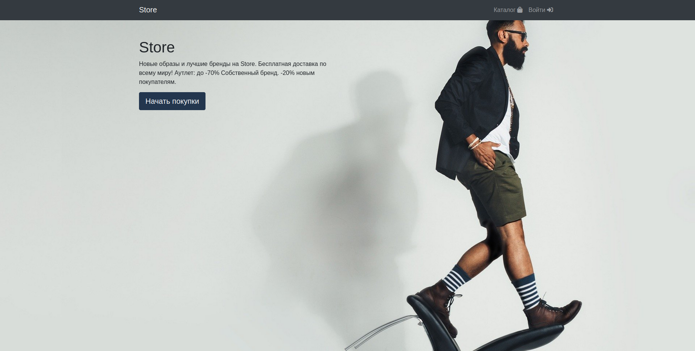
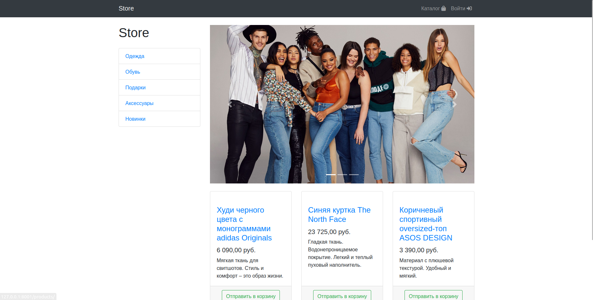

# Интернет-магазин на  Django

Учебный проект на Django.

### Реализованный функционал:

  *  Регистрация с активацией через почту;
  *  Создание товаров;
  *  Корзина;
  *  Пагинация и сортировка товара.
  *  Подключена платежная система (тестовый режим);
  *  Личный кабинет, изменение профиля;
  *  Реализована админ панель.
  *  Так же реализовано api с помощью django rest framework.

## Общий вид интернет-магазина:

## Что использовано для создания:

    Python 3, HTML, CSS;
    Django Framework;
    PostgreSQL;
    Redis;
    Celery;

## Для запуска приложения используйте docker-compose:
    
    
    1. docker compose build
    2. docker compose up

Переменные заданы в файле `.env.example`.

Приложение запуститься на `http://localhost:8001.`

Для того чтобы работала отправка сообщения на **email** пользователя
после его регистрации для подтверждения **email**,
измените в `.env.example` параметры SMTP на свои.

